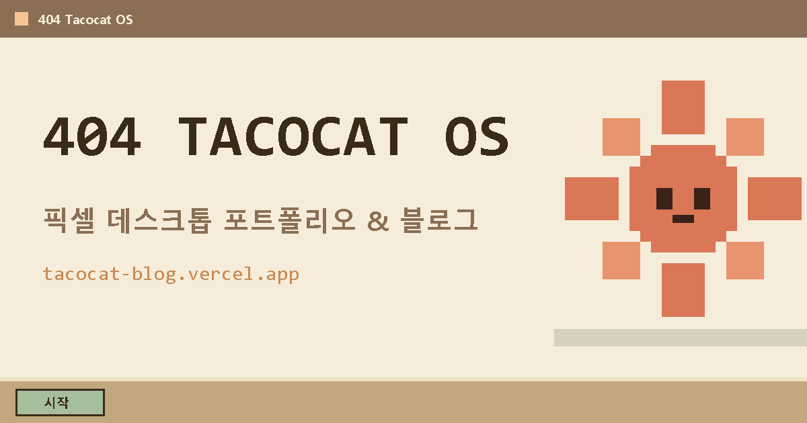

# 404 Tacocat OS — 픽셀 데스크톱 포트폴리오 & 블로그

> 레트로 데스크톱 OS를 통째로 흉내 낸 개인 포트폴리오 · 블로그.
> 부팅 화면으로 켜지고, 바탕화면 아이콘을 클릭하면 창이 열립니다.

**Live**: https://tacocat-blog.vercel.app



## 특징

- 🖥️ **데스크톱 OS UI** — 부팅 화면, 드래그 가능한 창, 작업표시줄(열린 창 버튼·최소화), 시작 메뉴
- 🍂 **사계절 애니메이션 배경** — 접속한 날짜의 계절에 맞춰 바탕화면이 바뀌고, 구름이 흐르고 꽃잎·낙엽·눈이 내립니다 (`?season=winter`로 미리보기)
- 🌐 **한/영 이중언어** — Astro i18n 라우팅 (`/` 한국어, `/en/` 영어)
- ✍️ **콘텐츠 = 마크다운 파일** — 비개발자도 `src/content/`에 파일만 추가하면 글 발행 ([작성 가이드](docs/CONTENT-GUIDE.md))
- ♿ **접근성** — 키보드 조작(Esc로 창 닫기, 포커스 관리), `prefers-reduced-motion` 존중, 시맨틱 dialog
- 🚀 **자동 배포** — `main`에 push하면 Vercel이 자동 배포

## 기술 스택

- [Astro 5](https://astro.build) + Content Collections (정적 사이트)
- 순수 CSS 애니메이션 + 인라인 SVG 픽셀아트 (프레임워크·라이브러리 없음)
- [Galmuri](https://github.com/quiple/galmuri) 픽셀 폰트
- Vercel 배포

## 개발

```bash
npm install
npm run dev     # http://localhost:4321
npm run build   # 정적 빌드 (dist/)
```

## 구조

```
src/
├─ components/
│  ├─ Desktop.astro    # OS 화면 전체 (창·아이콘·작업표시줄·JS)
│  └─ Wallpaper.astro  # 사계절 애니메이션 배경
├─ content/            # 글 (마크다운) — portfolio/awards/activities/study
├─ i18n/ui.ts          # 한/영 UI 문구
├─ layouts/Base.astro  # SEO 메타 포함 기본 레이아웃
├─ pages/              # / (ko), /en/, /404
└─ styles/pixel.css    # 픽셀 디자인 시스템
docs/
├─ PLAN.md             # 기획안
├─ DEVLOG.md           # 프롬프트↔변경사항 개발 로그
└─ CONTENT-GUIDE.md    # 비개발자용 글쓰기 가이드
```

## 크레딧

[Claude Code](https://claude.com/claude-code)와 함께 기획→구현→배포 전 과정을 페어링으로 만들었습니다.
과정 기록은 [docs/DEVLOG.md](docs/DEVLOG.md)에 있습니다.
