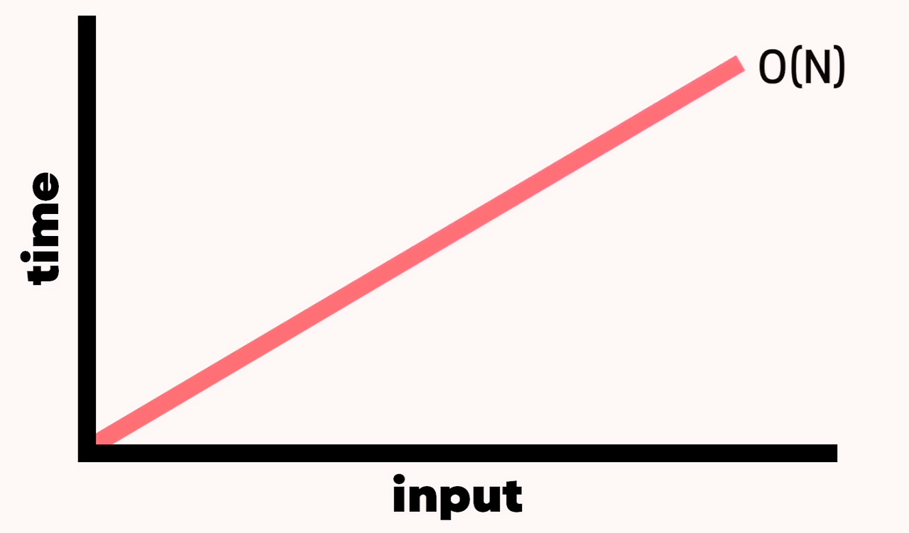
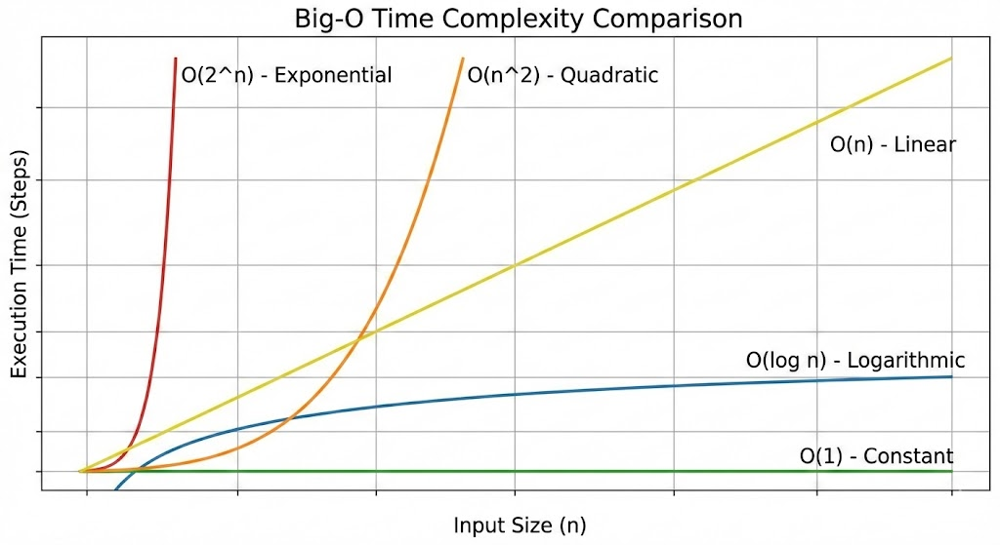

> 알고리즘의 실행 시간을 하드웨어·언어에 상관없이 수학적으로 표현하는 척도가 **Big O 표기법**이다. 몇 초 걸리는지가 아니라, 입력값 N이 커질 때 **최악의 경우** 실행 횟수가 어떻게 변하는지를 본다.

## 1. 시간복잡도란?

알고리즘 실행 시간은 하드웨어 사양, 운영체제, 언어에 따라 실제로 다 다르게 걸린다. 이를 명확히 하기 위해 등장한 것이 **Big O 표기법**이며, 점근적 표현법의 하나로 상수와 계수를 제거해 복잡도를 단순화하는 것이 목적이다.

핵심은 다음과 같다.

- 몇 초 걸리는지가 아니라 **입력값(N) 크기에 따른 실행 횟수의 변화**를 측정한다.
- 항상 **최악의 경우(worst case)**를 기준으로 계산한다. 성능을 체크하는 목적이므로, 가장 크고 오래 걸리는 입력이 들어와도 버틸 수 있는지를 봐야 하기 때문이다.

**예시 — 선형 검색**

```python
def linear_search(arr, target):
    for i in range(len(arr)):
        if arr[i] == target:
            return i
    return -1
```

데이터가 N개면 최악의 경우 N번의 step이 필요하다 → **O(N)**, 즉 데이터 크기에 비례해 시간이 늘어나는 직선시간이다.


*O(N) = 데이터가 N개면 N스텝이 필요하다.*

---

## 2. 주요 시간복잡도 유형

| 표기법 | 이름 | 설명 |
| --- | --- | --- |
| O(1) | 상수시간 | 데이터 크기와 무관하게 항상 일정 |
| O(log n) | 로그시간 | 연산마다 확인할 데이터양이 절반씩 감소 |
| O(n) | 선형시간 | 데이터 크기에 비례해서 증가 |
| O(n²) | 2차시간 | 중첩 반복문에서 주로 발생, 급격히 증가 |
| O(2ⁿ) | 지수시간 | 재귀가 거듭될수록 기하급수적으로 증가 (가장 비효율적) |


*입력이 커질 때 각 복잡도가 얼마나 가파르게 벌어지는지 한눈에 보인다.*

### O(1) — 상수시간

```python
def get_first_element(arr):
    return arr[0]
```

### O(log n) — 로그시간

연산이 진행될 때마다 확인해야 할 데이터의 양이 절반으로 줄어든다. (예: 이진 탐색)

```python
def binary_search_logic(n):
    count = 0
    while n > 1:
        n //= 2
        count += 1
    return count
```

### O(n²) — 2차시간

주로 중첩 반복문에서 발생하며, 데이터가 조금만 늘어도 연산 횟수가 급격히 증가한다.

```python
def print_pairs(arr):
    for i in arr:
        for j in arr:
            print(i, j)
```

### O(2ⁿ) — 지수시간

재귀 호출이 거듭될수록 실행 횟수가 기하급수적으로 늘어나는, 가장 비효율적인 구조.

```python
def fibonacci(n):
    if n <= 1:
        return n
    return fibonacci(n - 1) + fibonacci(n - 2)
```

### 효율성 순서

```text
O(1) < O(log n) < O(n) < O(n log n) < O(n²) < O(2ⁿ)
```

주어진 환경에서 가장 적합한 알고리즘을 선택해 최선의 속도를 내는 것이 중요하다.

---

## 3. Big O 핵심 규칙 — 상수는 버린다

```python
def print_twice(n):
    for i in range(n):
        print(f"첫 번째 루프: {i}")
    for j in range(n):
        print(f"두 번째 루프: {j}")
```

반복문이 두 번 도니까 O(2N)이라고 착각하기 쉽지만, Big O의 목적은 **데이터 증가율에 따른 성능 변화**를 보는 것이므로 상수나 작은 숫자는 과감히 버린다.

→ 이 코드의 시간복잡도는 O(2N)이 아니라 **O(N)**이다.

---

## 4. 반복문에서의 시간복잡도 (심화)

기본 연산만으로 계산할 땐 문제 없지만, **while문**이 코드에 들어오면 시간복잡도 계산이 조금 복잡해진다. 반복문을 언제 빠져나올지 확실하지 않기 때문이다.

시간복잡도는 일반적으로 **최악의 경우**를 기준으로 계산한다는 원칙을 다시 상기하며 아래를 보자.

### for문

```text
set x = 0
for i = 0 ... i < 10
  x += 1
  print(x)
```

for문에 의해 내부는 10번 반복된다. 내부 코드가 O(1)이므로 10번을 반복해도 O(1 × 10) = O(1)이다 (상수 무시).

반면 반복 횟수가 불분명한 값(n)이라면 상황이 달라진다.

```text
function example(n)
  set x = 0
  for i = 0 ... i < n
    x += 1
    print(x)
```

내부 코드는 여전히 O(1)이지만, N번 반복하므로 전체는 **O(N)**이 된다. N의 값을 알 수 없기 때문에 일반적으로는 N을 그대로 둔다.

```text
set x = 0
for i = 0 ... i < n / 2
  x += 1
  print(x)
```

이 코드는 n/2번 수행되지만, Big O는 상수를 무시하므로 이 역시 **O(N)**이다.

### while문

while문은 반복문을 탈출하는 조건이 불분명하므로 for문보다 생각할 것이 많다.

```text
function example(n)
  while 0 > n or n > 100
    if n < 0
      n++
    else
      n--
  return n
```

- n이 0과 100 사이에 있으면 반복문에 진입 자체를 안 하므로 **O(1)**.
- 하지만 n이 아주 큰 값이라면, 100 이하로 내려갈 때까지 계속 순회해야 하므로 이론적으로 **N − 100회**의 순회가 필요하다.
- 따라서 시간복잡도는 O(1 × (N − 100)) = O(N)이 된다.

이런 경우를 잘 판단해서 시간복잡도를 하나씩 구해봐야 한다.

### Side Note — 중첩 for문과 별도 for문이 함께 있을 때

```text
set x = 0
for i = 0 ... i < n
  for j = 5 ... j < n
    x += 1
    print(x)

for i = 0 ... i < n
  x += 1

print(x)
```

- 위쪽 중첩 for문: **O(N²)**
- 아래쪽 단일 for문: **O(N)**

N²이 항상 N보다 크기 때문에, 두 시간복잡도를 더해도 결과적으로 이 코드 전체의 시간복잡도는 **O(N²)**로 수렴한다 (큰 항이 지배함).

> 참고: 안쪽 for문이 `j = 5`부터 시작해도, 시작점 차이는 상수(5)일 뿐이므로 시간복잡도 표기(O(N))에는 영향을 주지 않는다.
