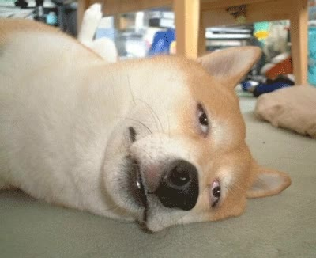
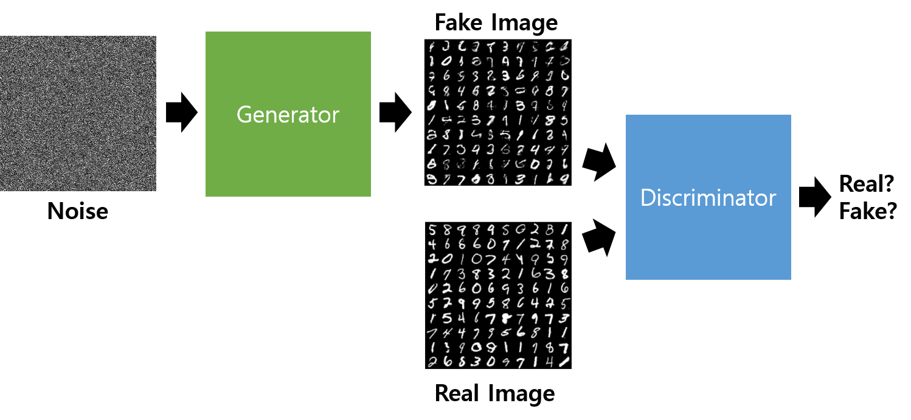

## 한계에 도달.. 새로운 방법은 없을까

본선 진출 점수대인 1080점, 내 점수는 1030점. 그러나 더 이상 점수가 나올 부분이 존재하지 않았다. 특히 아는 것 없이 클로드에게 시키다 보니까 내 모델이 어디가 문제고 어떻게 고쳐야 할지 하나도 알 수 없었다.

*점수는 막혔고, 뭐가 문제인지도 모르겠던 상태.*

특히 선배도 이렇게 대회하면 남는 게 없을 것이라고 하셨고, 나도 구조적으로 문제를 가지고 있음을 알고 있었으나 "고치기 귀찮고 점수 올리는 데도 바쁜데"라는 생각을 무의식적으로 가졌던 것 같다.

그래서 아예 처음부터 이번 대회가 어떤 대회인지 이해해보고, 데이터 형태와 점수를 측정하는 방식, 모델은 어떤 게 있고, 학습이 잘되게 데이터들을 분해하는 기법이라던지 전체적으로 공부와 병행하면서 하는 걸 목표로 하였다.

또한 저번 1030점쯤부터 점수 올릴 부분이 없고, 그렇다 보니까 딥서치와 GAN 토론 방식을 채택했었는데, GAN 토론 방식이란 GAN(생성적 적대 신경망)에서 얻은 아이디어이다.

*GAN의 기본 구조. 생성자(Generator)와 판별자(Discriminator)가 서로 경쟁하며 학습한다.*

GAN이란 두 신경망 사이에 경쟁을 붙여 학습시키는 것이 아이디어이다. 생성자와 판별자로 분리해서, 생성자는 실제 데이터와 최대한 유사한 이미지를 만들어내는 것이 목표이고, 판별자는 주어진 데이터가 실제 데이터인지 가짜 데이터인지 구분하는 모델이다.

나는 과거 이 내용을 교양과목에서 배우게 되었었는데, 그때 "그러면 두 에이전트들끼리 싸움 붙이면 더욱 좋은 실험이 나오지 않을까?"라는 생각이 떠올랐고, GAN 모델처럼 "너희도 딥서치한 방식으로 토론해봐"라고 했더니 더욱 좋은 실험 결과가 나왔었다. 결과적으로 **30점이나 오르는** 좋은 결과를 냈었다.

그 이후 이번 기반부터 학습하고자 할 때 전체적으로 시스템을 개편할 필요를 느껴, GAN 토론 방식에서 아이디어를 얻어 **GAN 방식 ML 대회 학습 템플릿**으로 변경하였다.
