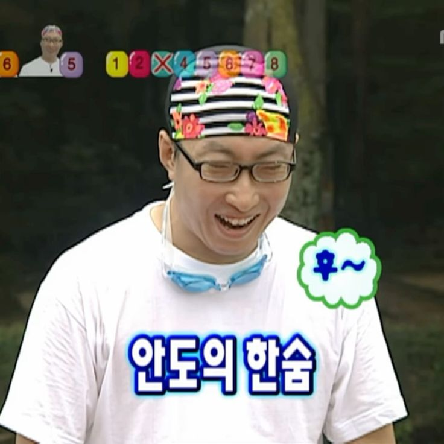
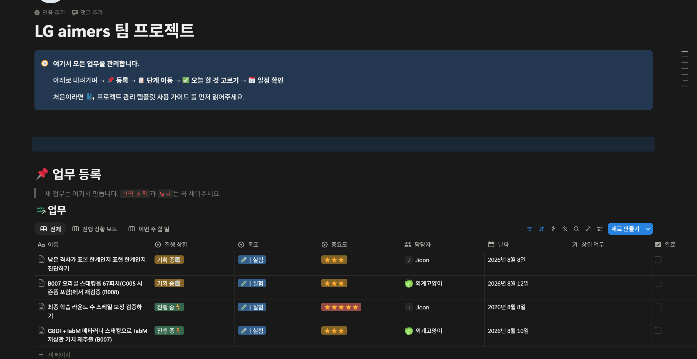
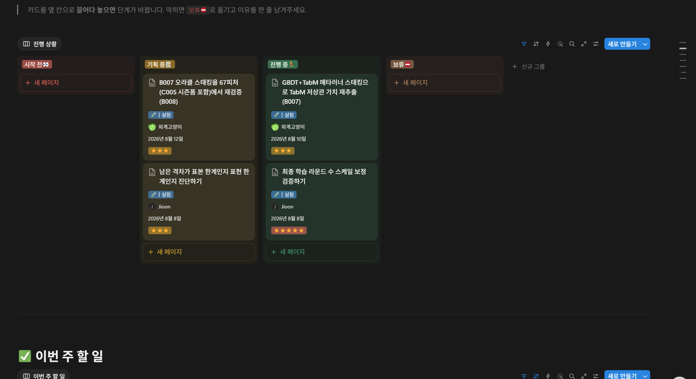
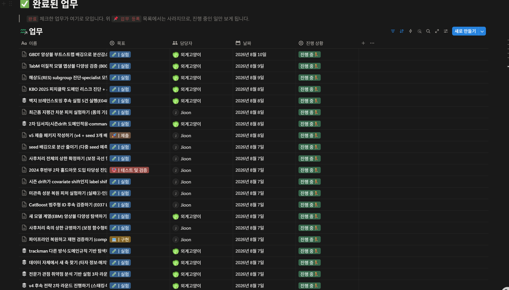
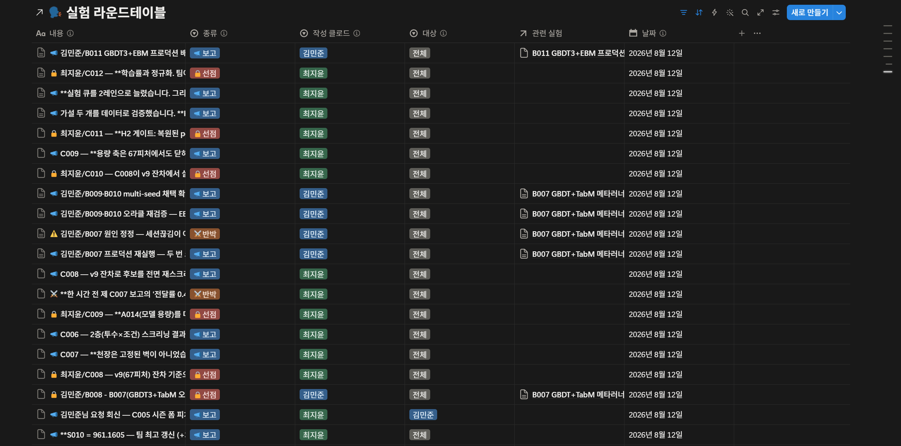

## 실사용 및 적용 후

역시나 팀원들에게 가이드 문서를 읽고 그대로 하라고 했으면 안 할 것 같다라는 생각이 적중했었고, 이를 대비하기 위해 미리 스킬을 만든 것이 너무나도 다행이였다.

*가이드 안 읽을 걸 예상하고 미리 스킬을 만들어둔 게 다행이었다는 안도의 한숨.*

비록 노션 학생 요금제에서는 클로드가 노션을 수정하기 위한 멤버 설정을 할 수 없어 유료로 18,000원 내고 결제하는 참사가 발생하긴 했지만, 앞으로의 경험과 팀플을 하며 생길 데이터, 가장 중요한 실사용 적용 경험값이라고 생각하면 꽤 싸게 먹혔다고 생각한다.

하지만 생각해보니 템플릿이든 가이드든 사람이 쓸 것을 염두에 두고 만들었기에, 사실상 클로드가 다 해주면 그냥 인공지능 특화 템플릿을 만들면 되는 것 아닌가? 라는 생각이 떠올랐다.

- 사람은 그냥 어떤 작업이 진행 중인지 알고 나중에 쌓인 데이터를 활용하면 되는 것이고
- 인공지능은 사람이 알 수 있게 데이터를 잘 남기고 전체적인 관리를 진행해주면 된다

라고 계획하였다. 그래서 아예 프로젝트 관리 템플릿을 → **MCP 팀플 관리 템플릿**으로 변경하였고, 여러 가지 수정사항·아이디어에 대해 고민하였다.

## 그럼 MCP 팀플 관리 템플릿의 장점은 뭔데

LG Aimers 대회를 하며 느낀 것은, 대회마다 웹을 만들라던지 대회 목적에 맞는 ML 모델을 만들라던지 다 대회 목적이 다른데 똑같은 템플릿을 사용하는 것이 옳은 방향이 아님을 알게 되었다.

그렇기에 이번 템플릿에선 내가 대회 시작 전 기획서나 대회에 대한 정보를 주면, 클로드가 내 마스터 템플릿을 분석하고 필요하거나 없는 속성은 수정해주고 필요한 블럭은 추가해주는 걸 제안하고 반영하도록 스킬의 **0단계**로 설정하였다.

물론 노션 ID를 통해 팀플 관리자인 내가 맞는지 확인하고 진행하며, 0단계가 진행된 템플릿이라면 표시하고 다른 팀원들이나 이후 팀 활동에선 0단계가 진행되지 않게 설정하였다. 즉 **스스로 대회에 맞게 진화하는 노션 팀플 템플릿**을 만들고자 한 것이다.

## 스스로 진화하는 노션 팀플 템플릿을 위해 필요한 것

- **노션에 팀플 전용 `claude.md` 만들기**
  claude.md를 파일에 만들면 항상 먼저 읽습니다. 그러나 해당 마크다운 파일은 로컬에 있어 팀플 중 변경사항이 있다면 스스로 추가해야 하는 번거로움이 있습니다. 그렇기에 노션에 팀플 전용 claude.md를 넣어 처음 세션을 시작할 때 읽게 하여 팀의 반영사항과 템플릿의 지침을 읽게 하였습니다(가이드 문서 작성, 각 문서별 지침).
- **속성값 하드코딩 금지**
  기존에는 진행 상황 │ select │ 시작 전👀 / 기획 중📝 / 진행 중🏃‍♀️ / 보류⛔ / 완료👍 이런 속성값들을 하드코딩하고 있었으나, 스스로 진화하는 특성상 새로운 특성과 사라지는 특성들이 많기에 고정 옵션과 가변 옵션으로 분리하였습니다.
- **구조가 실제 일하는 방식과 계속 어긋나면 개편을 제안**하여 전체 구조를 변경하는 것.
- **기록의 3분할** — 시간순 원본(업무 및 대화 로그) / 단계별 정리본(대회 과정) / 본인 몫(공부한 내용). *"포트폴리오·발표 재사용이 목적"으로 자세히 명시하고 구분.*

## 실제 대회 환경에서 적용 및 후기

*실제 대회에서 돌린 LG aimers 팀 프로젝트. 담당자 칸에 사람(Jioon)과 클로드(외계고양이)가 섞여 있다.*

*진행 상황 칸반 — 시작 전 / 기획 중 / 진행 중 / 보류.*

*완료된 업무. 실험이 수십 건씩 쌓였다.*

*실험 라운드테이블 — 보고·선점·반박 로그. '작성 클로드' 칸에 팀원별 클로드(김민준·최지윤)가 각자 남긴 기록이 보인다.*

실사용과 계획과는 정말 너무나도 달랐다. 툭하면 클로드는 맥락을 까먹었고, 안 쓰는 기능은 너무 많았고, 쓰는 것만 사용되며 내가 계획한 대로 되는 것이 없었다.

*계획과 현실은 너무나도 달랐다.*

가상환경을 설정해서 클로드를 사용하는데, 노션에 연결하는 데 멤버 시스템은 필요 없었으며 개발자 기능에서 토큰을 발급받으면 해결된다는 사실을 몰라 멀티에이전트 시스템 적용에서 꽤 애를 먹었다.

그럼에도 기존에 설계하였던 재설계 기능, 클로드와 노션의 연결로 이 템플릿의 단점을 확실하게 알고 개선해나갔으며 지금은 그래도 괜찮게 진행되고 있다.

- **맥락을 까먹는 문제**는 claude.md를 분할하여, 각 작업을 할 때 읽어야 하는 지침으로 남겨 해당 업무를 할 때만 그 지시를 불러오게 설정하여 해결하였다.
- **안 쓰는 기능은 제거**하고 많이 사용하는 기능은 세분화하여 자세히 기록을 남겼다.
- **팀원 클로드까지 들어오자 실험이 겹치는 문제**가 발생하여, 일련번호 ABC를 도입하고 선점 시스템을 도입하여 실험이 겹치는 문제를 제거하였다.

*그래도 멀티에이전트 오케스트레이션을 직접 실험해봤다는 뿌듯함.*

물론 아직 개선해나가야 할 방향은 많지만, 이번 대회를 통해 여러 에이전트를 돌리며 시스템을 구축하는 **멀티 에이전트 오케스트레이션**의 개념을 확립하고 실험해본 것 같아 뿌듯하다. 앞으로도 여러 대회를 거치며 나의 시스템을 더욱 구체화하고 유용하게 개선해나가야겠다고 다짐하였다.

---

> 📎 이 글은 [기록의 필요성](/study/record-keeping-necessity/) → [클로드 스킬이란?](/study/claude-skills-intro/) 로 이어지는 시리즈의 실전 적용 편입니다.
