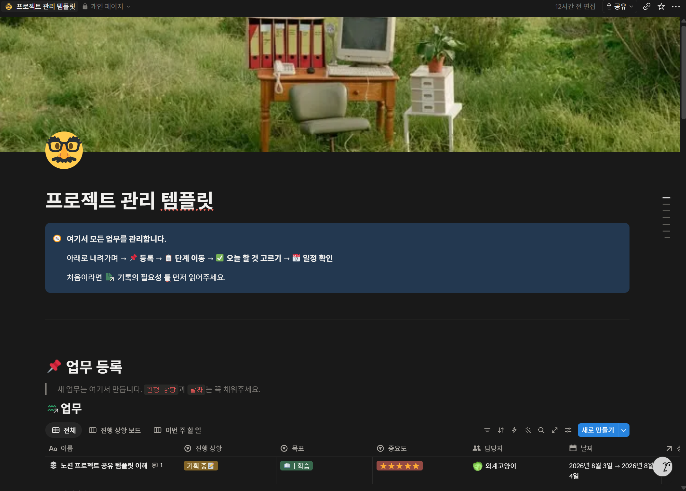
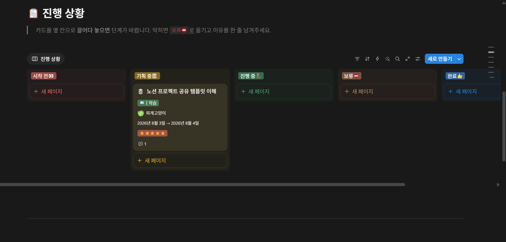
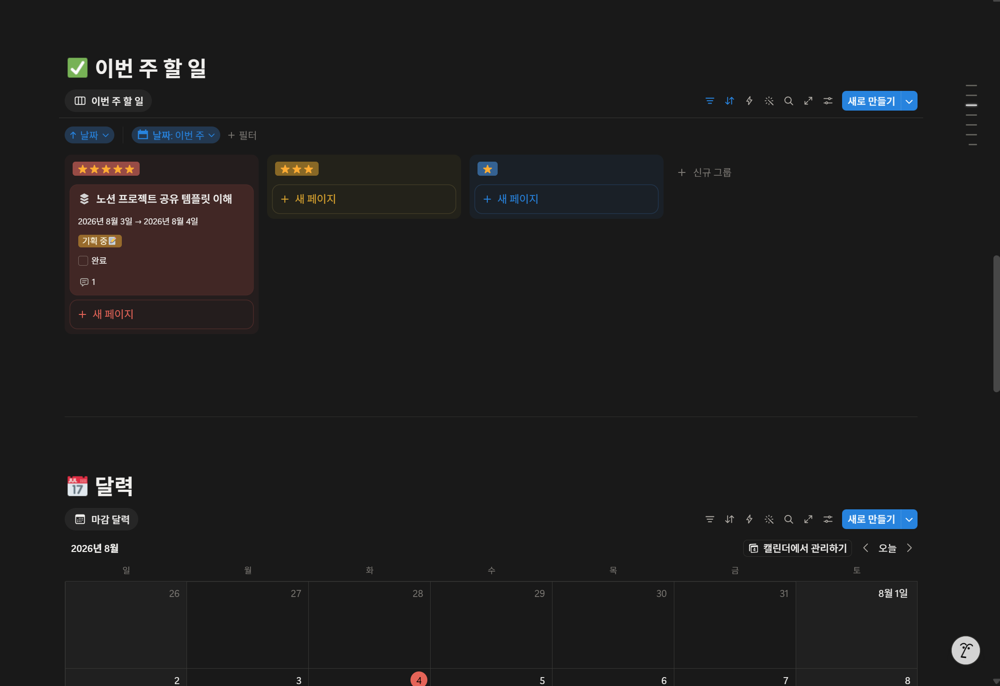
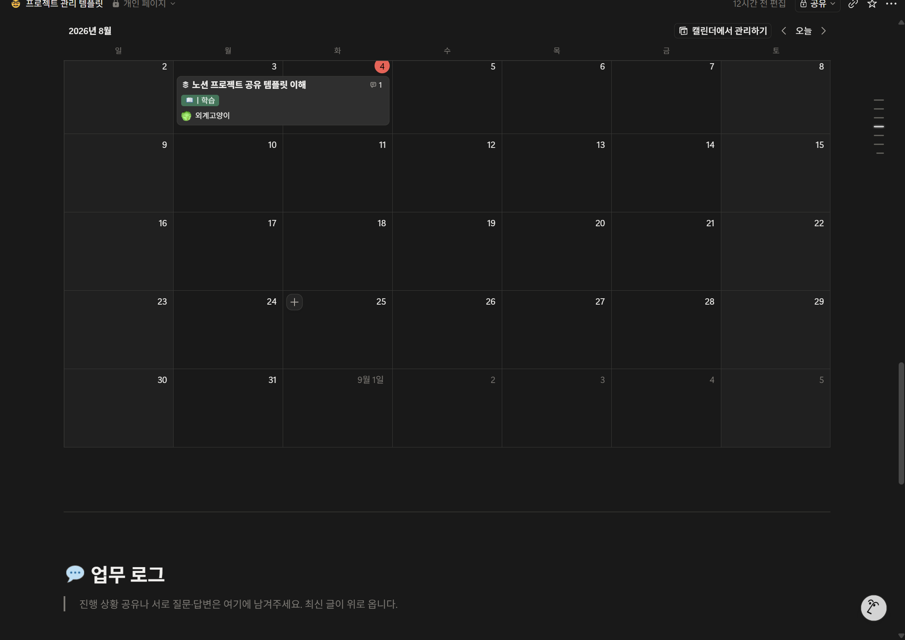
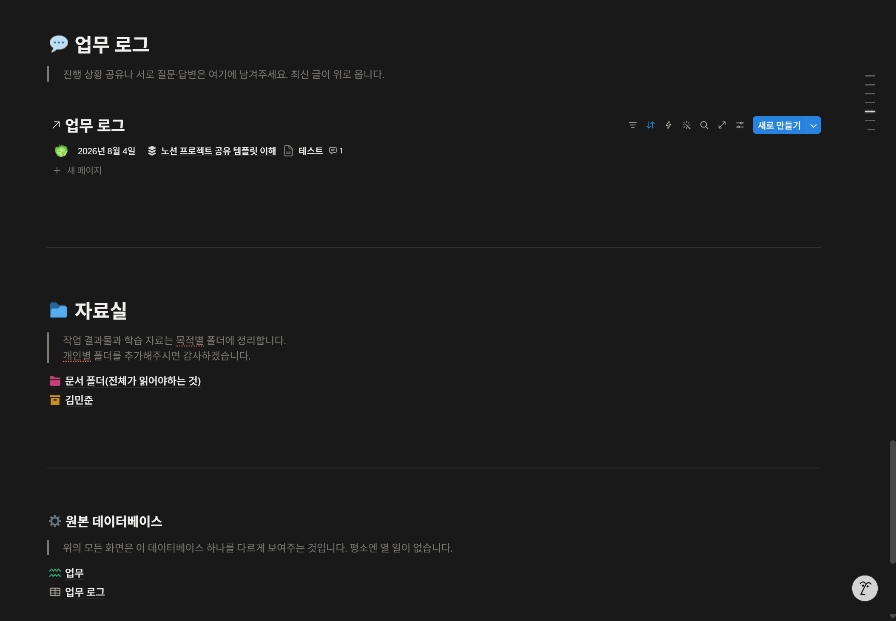
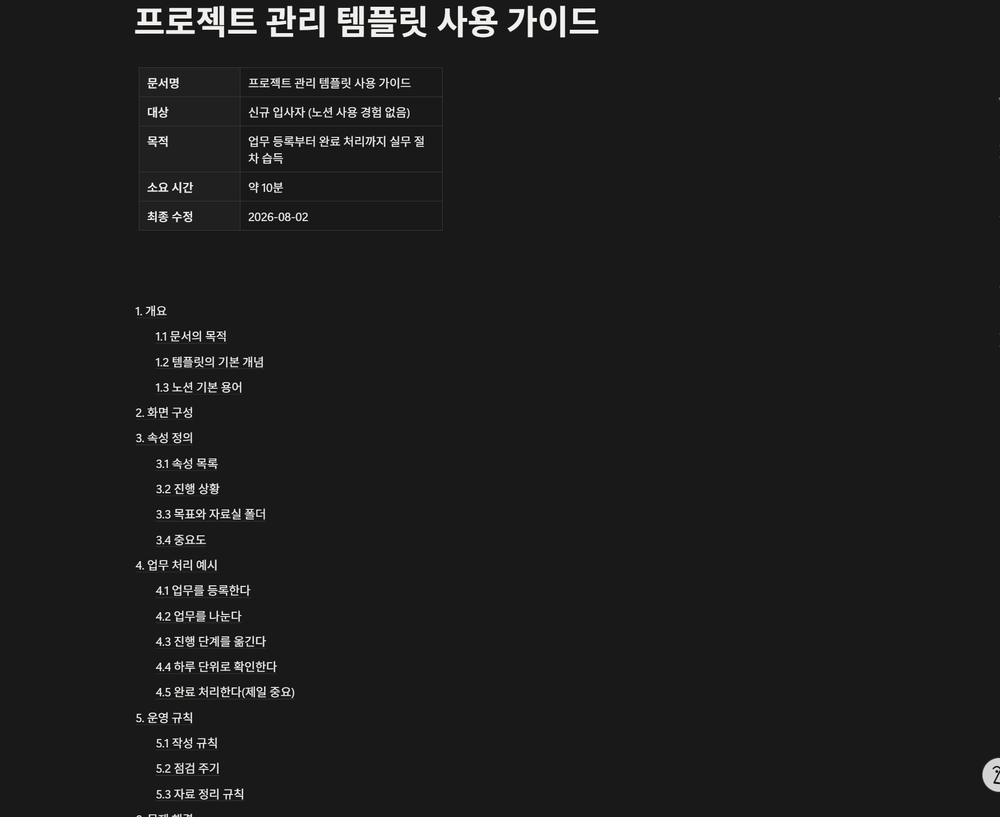

> ✍️ 기록하는 거 매우 귀찮고 시간 많이 걸리는 거 이해합니다. 저도 귀찮아서 과제들 다 클로드한테 "~~적어줘, 사람티 안 나게"라고 하거든요.
> 근데 대외활동이나 팀플에서 기록은 매우매우 귀중한 자원입니다.

---

## 취업 준비에서의 실질적 차이

주위 취준하는 선배님들 이야기를 듣다 보면 많이 나오는 이야기가 있습니다. 바로 쓸 재료가 없다는 거죠.

엥? 근데 선배님들은 대학 생활 중에도 대외활동, 팀플을 많이 하셨는데 쓸 소재가 없다는 게 말이 되는 걸까요.

한 활동은 많죠. 근데 기록이 없어 이력서나 포트폴리오를 쓸 때 "OO 프로젝트 참여, ~~기술 스택 사용"밖에 남기지 못합니다. 왜냐면 기억이 안 나거든요. 그렇게 많은 활동에서 내가 어떤 문제를 해결했고 고난이 있었으며 어떻게 헤쳐나갔는지 자세한 기록이 없기 때문입니다.

기록만 있었더라면 다음과 같이 작성할 수도 있었습니다.

> 기존 파이프라인의 처리 시간이 12분이었고, 병목이 전처리 단계에 있다고 판단했습니다. 세 가지 대안을 검토했고 그중 A를 선택한 이유는 OO였습니다. 결과적으로 4분으로 단축하였으나, B 방식을 택했다면 더 나았을 것이라는 점을 이후에 확인하였습니다.

특히나 면접에서 자주 나오는 질문들 또한 대부분 과정을 물어봅니다.

"왜 A 기술을 사용하였나요", "OO 프로젝트에서 문제가 있었나요? 있었으면 어떻게 해결하였나요?" 결과만 기억하고 있다면 답할 수 없는 질문들입니다.

---

## 포트폴리오에서도 중요한 건 결과물이 아닌 과정

완성된 산출물만 모은 포트폴리오는 변별력이 없습니다. 비슷한 수준의 결과물은 누구나 만들 수 있고, 특히 요즘 AI가 코딩해주는 시대에는 더욱더 의미 없는 결과물이 되어버렸습니다.

그러면 차별점은 무엇일까요?

어떻게 거기까지, 무엇을 활용해, 어떤 생각으로 갔는가입니다.

무엇을 시도했다가 버렸는지, 어디서 막혔고 어떻게 해결하였는지, 무엇을 잘못 판단하였는지. 이러한 경험들이 포트폴리오에서 가장 중요한 차별점입니다.

그래서 이번 템플릿에서 제가 업무마다 목표와 진행메모, 결과 및 인사이트를 남기라고 하는 이유가 이것 때문입니다. 나중에 포트폴리오를 만들기 위해 고생하는 것보단 일하면서 미리 만들어 두는 것입니다.

---

## 기록 비용을 낮추는 방법이 있을까

기록 좋은 거 누가 모릅니까. 지나가는 개도 아는데. 근데 왜 안 할까요. 개ㅐㅐㅐㅐㅐㅐㅐㅐㅐㅐㅐㅐㅐㅐㅐㅐㅐ귀찮기 때문입니다.

공부도 해야 하고, 과제도 해야 하고, 술도 마셔야 하고, 대외활동도 해야 하고, 놀기도 하고, 잼얘도 해야 하는데 — 인생 바쁜데 언제 기록합니까.

근데 요즘 어떤 시대입니까. 바로 대 AI시대죠. 요즘은 MCP를 통해 AI 도구가 노션, 이메일 등 다양한 외부 서비스에 접근하게 해주는 연결 규격 서비스가 존재합니다. 이를 이용하면 다음이 가능해집니다.

- 대화하듯 지시해 업무를 등록하고 상태를 갱신
- 흩어진 기록을 불러와서 주간보고, 회고를 작성
- 특정 기간의 작업 내역을 모아 글을 작성
- 문서 구조나 템플릿 수정

핵심은 기록하는 데 드는 시간과 노력이 줄어든다는 점입니다. 옛날엔 아 글 써야지 귀찮은데 하고 하나하나 작성했지만, 한 문장 "~~작성해줘"로 처리할 수 있다면 부담스러운 추가 업무가 아닌 일하는 과정이 됩니다.

그러나 문제점이 존재합니다. 구조화된 형태로 데이터가 쌓여 있어야 합니다. 메모장이나 여러 곳에 흩어진 텍스트는 AI가 정리하기 힘듭니다. 그래서 날짜, 상태, 목표 같은 속성이 붙어 있는 기록이어야 나중에 자동으로 꺼내 쓸 수 있습니다. 이 템플릿이 속성 입력을 요구하는 이유이기도 하고, 노션을 써야 하는 이유이기도 합니다.

그래서 팀플 전용 노션 템플릿을 만든다면 어떨까? 라는 생각으로 노션 템플릿을 기획하고 구현해보고자 했습니다.

---

## 어떤 기능을 넣지

아 솔직히 말해서 팀플 팀원이 어떤 형식대로 쓰라고 해서 봤는데 복잡하고 머리 아프면 나였어도 안 할 것 같아서, 대상을 일단 노션을 모른다고 가정하고 최대한 단순하게를 목표로 했습니다.

그럼 어떤 기능이 필요한가, 내 생각은 어떤지 적어봤습니다.

- 노션을 처음 쓰고 해당 템플릿이 처음인 사람을 위한 가이드 문서
- 업무를 추가할 블럭
- 진행상황을 관리할 블럭
- 마감일을 표시할 캘린더
- 주별 todolist (중요도별로)
- 개인별·공용 문서 폴더함

## 그럼 각 기능의 구체적인 역할은 뭔데?

- 가이드 문서
  처음 노션을 사용하는 사람이 봐도 어렵지 않은 수준으로, 여기엔 어떤 내용을 어떤 형식으로 채워야 하는지 명시적으로 설명하는 문서.
- 업무를 추가할 블럭
  여러 DB로 나누어져 마감일, 중요도, 담당자, 진행상황을 나누면 머리가 아프니까 하나의 DB에서 전체를 관리하게 하고 여러 관점으로 바라보도록 설계하였습니다.
  필요한 속성: 이름(필수), 진행상황, 목표, 중요도, 담당자, 날짜, 완료여부 / 부차적 속성(개인적 기록을 위한): 목표, 진행 로그, 결과 및 인사이트, 출력 문서
- 진행상황을 관리할 블럭
  생각보다 사람들은 눈에 보이는 시각적 성장을 좋아합니다. 이에 나의 업무가 어디까지 진행되었고 성취도를 주기 위해 기록을 일의 동작 자체로 만들었습니다.
- 마감일을 표시할 캘린더
  여러 개의 업무가 한 번에 추가되어 이를 한눈에 보면 정신없기에, 하나의 캘린더를 만들어 직관적으로 오늘 안에 어떤 업무를 해야 하는지 알 수 있게 만들고자 했습니다.
- 주별 todolist
  중요도별로 이번 주에 처리해야 할 업무를 보여줍니다.
- 개인별 폴더와 공용 폴더
  공용 폴더에는 목표와 자료실 폴더를 1대1 대응시켜 해당 업무에 대한 출력물을 저장하게 만들었고, 개인별 폴더에는 개인의 경험, 통찰, 업무 과정을 기록하게 하였습니다.

*모든 업무를 여기 하나에서 관리한다. 등록 → 단계 이동 → 오늘 할 것 고르기 → 일정 확인 순서.*

*카드를 옆 칸으로 끌어다 놓으면 단계가 바뀐다. 막히면 보류로 옮기고 이유를 한 줄 남긴다.*

*중요도별로 이번 주 할 일만 걸러서 보여준다.*

*달력은 오늘 뭘 해야 하는지 한눈에 보라고 만든 뷰.*

*위의 모든 화면은 결국 하나의 데이터베이스를 다르게 보여주는 것뿐이다.*

이제 클로드를 통해 내가 기획한 내용을 바탕으로 위와 같은 노션 팀 프로젝트 템플릿을 만들었습니다.

## 가장 큰 문제점

작동도 잘되고 템플릿 자체도 너무너무 좋은 업무 흐름을 보여준다고 생각합니다. 근데 솔직하게 사람이 로봇도 아니고 저거 다 남기면서 팀플까지 하라고 하면 할까 싶기도 했으며, 글을 3줄 이상 읽지 못하는 제가 이런 팀원을 만나서 가이드 문서를 봤는데

목차가 이렇게 생겨먹었으면 하기 싫을 것 같은 느낌이 스멀스멀 올라왔습니다.

그래서 좋은 대안에 대해 고민해봤었는데, 요즘 팀플하면 다 클로드나 코덱스로 코드를 짜니까 클로드한테 시키면 되지 않을까? 라는 생각을 하였고 이를 구현하기 위해 다양한 방법을 찾아보았습니다.

찾아보니 클로드 스킬이라는 모듈을 통해 간단하게 반복적인 작업을 대체할 수 있더라고요. 그래서 스킬에 대해 알아보고 이를 개선할 방향을 탐색하였습니다. 이후 이야기는 다음 글인 [클로드 스킬이란?](/study/claude-skills-intro/)에서 이어가겠습니다. 이만.
